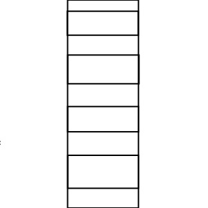
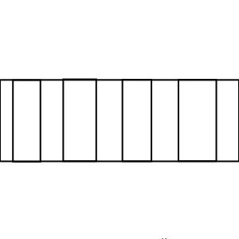
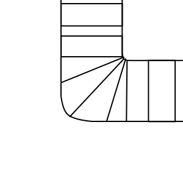
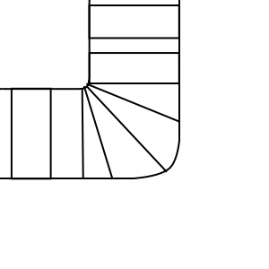
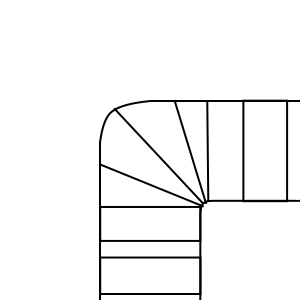
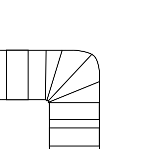

# Train Tracks Puzzle

A simple yet engaging web-based puzzle game where the objective is to complete a track layout based on set constraints.

## Overview

This project is a front-end application built with vanilla HTML, CSS, and JavaScript. It presents the user with an 8x8 grid and a selection of track pieces. The goal is to fill the grid with tracks, adhering to the rule that each row and column can only contain a maximum of three track pieces.

## How It Works

The application's logic is self-contained within three core files: `tracks.html`, `tracks.css`, and `tracks.js`.

*   **`tracks.html`**: Provides the basic structure of the application, including the main grid container, the track selector panel, and the links to the stylesheet and script.
*   **`tracks.css`**: Defines the visual appearance of the game. It styles the grid, the individual cells, the track pieces, and the row/column counters that display the remaining track placements allowed.
*   **`tracks.js`**: Contains all the game's functionality, structured using object-oriented principles.

### Technical Architecture

The JavaScript is organised into four main classes that work together to create the game experience:

1.  **`Track`**: A simple data class representing a single type of track piece. It stores a unique ID and the path to its corresponding image. It has methods to apply or remove its image from a grid cell.

2.  **`Cell`**: Represents a single square on the game grid. Each cell object tracks its position (row and column), whether it currently holds a track (`currentTrack`), and if it's a fixed, unchangeable part of the puzzle (`isFixed`). It is also responsible for its own HTML `
` element.

    A key aspect of the `Cell` is how it determines its own coordinates. When the `Grid` is built, it creates 64 `Cell` objects, giving each a unique index from 0 to 63. The `Cell`'s constructor then uses this index to calculate its row and column mathematically:
    *   **Row Calculation**: `Math.floor(index / 8)`
    *   **Column Calculation**: `index % 8`

    This approach means that every cell instantly knows its position without needing to query the DOM or rely on complex data structures. This `Cell` object, complete with its coordinates, is then passed directly to click handlers, making event logic clean and efficient.

3.  **`Grid`**: Manages the entire 8x8 grid. It creates and holds all the `Cell` objects and, critically, enforces the game's primary rule by tracking the number of tracks placed in each row and column (`rowCounts` and `columnCounts`).

4.  **`TracksGame`**: The main controller that orchestrates the entire game. When a new game is initiated (via `new TracksGame()`), its `constructor` method executes a sequence of setup operations:
    *   It instantiates the `Grid`, which dynamically builds the HTML grid and appends it to the document.
    *   It initialises the track selector, loading the images for each track piece and setting up click listeners.
    *   It places the initial, fixed track pieces onto the grid.
    *   It creates and displays the row and column count indicators.
    *   Finally, it assigns a central click handler (`handleCellClick`) to every cell, which manages the logic for placing or removing tracks based on player actions and the game's rules.

## Gameplay

The player selects a track piece from the panel on the right. They can then click on any empty cell in the main grid to place it. Clicking on a cell that already contains a track will remove it.

The numbers displayed along the top and left of the grid indicate how many more track pieces can be placed in that specific column or row, respectively. The goal is to create a valid track layout where all counters are at zero.

## Available Track Pieces

Here are the track pieces used in the game:

| Straight | Horizontal | Top Right Corner | Top Left Corner | Bottom Right Corner | Bottom Left Corner |
| :---: | :---: | :---: | :---: | :---: | :---: |
|  |  |  |  |  |  |
